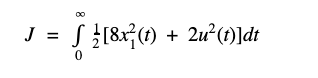
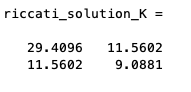

### <ins>MatLab Linear Quadratic Regulator Script</ins>

#### <ins>To run script</ins>

* Make sure both lqr.m and main.m are in the same folder
* Run main.m 

#### <ins>Example problem</ins>

For part of my final project for my Optimal Control Design class I had 
to write a script that would solve for the optimal trajectories and control of a second order linear quadratic regulator problem.
This is without the use of MatLab's lqr function from the control system toolbox.

This example aims to show how solving for the optimal feedback gain using the custom lqr function can minimize the 
performance criteria given.

The system that was given:

 
 
The performance criteria, J, to minimize:
 
 

System matrices:

 

The system is both controllable and observable:

 

The open loop system eigenvalues show that this is a unstable system due to both of the eigenvalues
being in the right half of the complex plane.

 

Since the system is controllable and observable we can utilize a full state feedback control to
move the systems eigenvalues to the stable left half part of the complex plane.

After testing the system with a unity feedback gain the follow results were achieved:

 
 
Note: knowing that this is a linear quadratic system we can first try and assume the optimal control to 
be u(t) = -Fx
 

 

In this case, you can see that the system is still currently unstable.
Before giving the optimal feedback gain from the lqr function I picked a feedback gain that
stabilizes the system to eventually compare the performance values.
The feedback gain chosen is F = [5 , 5] and the results for it are shown below:

 
 
 

 

The result shows that the system is stable and approaches zero in steady state from the initial state values of x(0) = [1 , -2 ].
However, the performance value, J, can still be minimized by solving for the optimal feedback gain. To get the optimal feedback gain the 
lqr function finds the solution to the algebraic riccati equation (ARE) since our performance measure is based on a 
infinite time horizon. The feedback gain F = R^-1 * B' * K where R is the control cost matrix, B is the system control matrix 
and K is the solution of the riccati equation. The results are as follows:

 
 
 Note: These will be the optimal trajectories and control to use that will minimize the given
 performance criteria, J.
 

 

 

As you can see by solving for the optimal feedback gain, F, the lqr function was able to minimize
the performance criteria, J, from 6.333 to 4.6243. This essentially show that the overall systems cost has been 
reduced.
